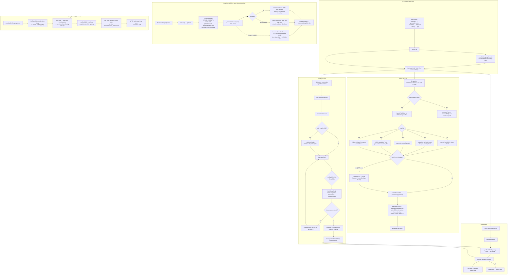
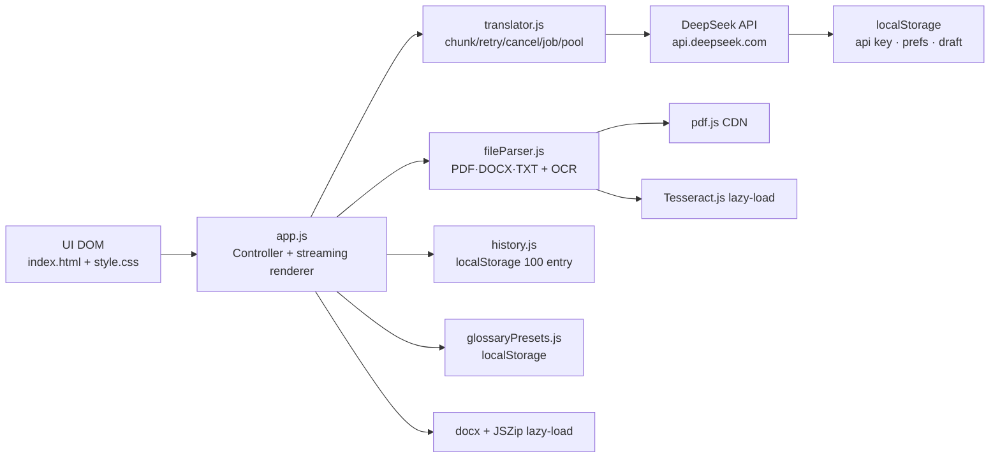

# AI Translate — Architecture

Ứng dụng dịch thuật AI client-side dùng **DeepSeek API**, chạy hoàn toàn trên trình duyệt (static HTML + CDN, không build tool, không backend).

## Thành phần

| File | Vai trò |
|------|---------|
| `index.html` | Giao diện chính, 4 tab: Text / File / Batch / History |
| `css/style.css` | Tất cả styles (dark/light theme, responsive, a11y) |
| `js/app.js` | Controller UI + streaming renderer + keep-format Office (docx/pptx/xlsx) + CSV |
| `js/imageTranslator.js` | Dịch text trong ảnh nhúng: OCR (bbox) → translate → vẽ lại lên ảnh |
| `js/translator.js` | Client DeepSeek API: chunking, retry, streaming, cancel, pool |
| `js/fileParser.js` | Đọc file PDF/DOCX/TXT + OCR (Tesseract) |
| `js/history.js` | Lịch sử dịch (localStorage, 100 entry) |
| `js/languages.js` | Danh sách ngôn ngữ tập trung (single source of truth) |
| `js/glossaryPresets.js` | Preset glossary (localStorage) |

## Kiến trúc & luồng chính

## Sơ đồ lớp dữ liệu

## Ghi chú

- API key lưu trong `localStorage` — rủi ro XSS, chỉ gửi tới DeepSeek.
- Các thư viện nặng (Tesseract, docx, JSZip) lazy-load từ CDN khi cần.
- Giá DeepSeek hardcode trong `app.js` (`PRICE_PER_MILLION_*`) — cần cập nhật theo bảng giá hiện tại.
